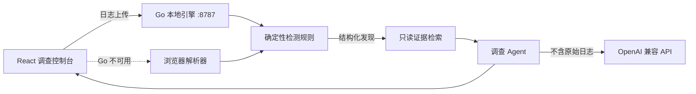

<div align="center">

# 🕵️ LogSleuth

[](https://github.com/C-8H11N/logsleuth/actions/workflows/ci.yml)

### 让本地 Agent 从日志与流量中重建攻击过程

**Go 高性能分析引擎 · React 调查控制台 · 多模型 AI Agent · 本地优先**

[](https://go.dev/)
[](https://react.dev/)
[](#隐私与安全边界)
[](LICENSE)

[快速开始](#-快速开始) · [核心能力](#-核心能力) · [架构](#-系统架构) · [Agent](#-investigation-agent) · [English](#english)

</div>

---

## ✦ 项目定位

LogSleuth 是一个面向防御调查的本地安全工作台。它使用 Go 流式处理大型 Web 访问日志，通过浏览器解析 PCAP/PCAPNG，并将确定性规则发现交给 AI Agent，生成可追溯、可复核的攻击时间线。

```text
   RAW EVIDENCE          LOCAL DETECTION             INVESTIGATION AGENT
 ┌──────────────┐      ┌──────────────────┐         ┌────────────────────┐
 │ Access Logs  │ ───▶ │ Go Stream Engine │ ──────▶ │ Attack narrative   │
 │ PCAP/PCAPNG  │      │ Browser Fallback │         │ Evidence citations │
 └──────────────┘      └──────────────────┘         │ Safe next steps    │
                                                    └────────────────────┘
```

> 原始日志不会发送给模型。Agent 只接收经过本地规则提取的结构化发现，并且每条结论都应回到 IP、时间、请求路径和规则类别进行核实。

## ⚡ 核心能力

| 能力 | 当前状态 | 说明 |
|---|:---:|---|
| Go 流式日志分析 | ✅ | 分块读取 Apache/Nginx 日志，避免浏览器一次加载大文件 |
| 浏览器自动回退 | ✅ | Go 未启动时自动切换为 `BROWSER MODE` |
| PCAP / PCAPNG | ✅ | 根据文件头识别真实格式，不依赖扩展名 |
| 大型抓包全量流式分析 | ✅ | 以 8 MiB 分块扫描完整文件，显示实时进度且不创建与包数量等长的数组 |
| Web 攻击检测 | ✅ | SQLi、XSS、路径穿越、命令注入、敏感文件、Log4Shell、SSRF、WebShell 等 |
| 行为聚合 | ✅ | 连续同类事件折叠，完整证据保留在报告中 |
| 多模型 Agent | ✅ | OpenAI、DeepSeek、通义千问、Kimi、自定义兼容 API |
| 攻击会话关联 | ✅ | 按来源 IP 和 30 分钟窗口关联阶段、可信度与证据编号 |
| 对话式调查 Agent | ✅ | 支持持续追问，并通过 `[E#]` / `[S#]` 引用证据和会话 |
| Agent 本地证据检索 | ✅ | 根据问题、IP、攻击类型和证据编号，只选取相关证据进入模型上下文 |
| 只读调查工具 | ✅ | 记录 `search_findings`、`get_evidence`、`get_session` 等确定性工具轨迹 |
| 引用真实性校验 | ✅ | 自动验证模型返回的 `[E#]` / `[S#]`，不存在的引用会标红并禁止跳转 |
| 双语界面 | ✅ | 中文 / English 一键切换 |
| 调查报告 | ✅ | 导出 Markdown 调查报告 |
| TCP 流重组 | ✅ | 有界单向窗口：乱序、重传、序列号回绕；缺口和冲突提示 |
| HTTP 证据关联 | ✅ | 保守配对单次 HTTP/1.x 请求/响应，导出窗口包引用与抓包时间 |
| 自定义 YAML 规则 | 🧭 | 规划中 |
| Windows 桌面版 | 🧭 | 规划中 |

## 🧠 Investigation Agent

### TCP analysis update / TCP 分析更新

抓包检测现在先对 TCP 负载进行有界重组，再识别明文 HTTP/1.x，不再仅检查固定端口的单包前 512 字节。单向连接窗口最多 256 KiB / 2048 段，所有窗口负载合计最多 16 MiB，最多跟踪 2048 个方向。达到上限时分析并释放旧窗口，界面与 JSON 警告会提示覆盖受限；这些是负载预算，不是整个程序的内存上限。

TCP payloads are reconstructed in bounded directional windows before plaintext HTTP/1.x detection, including on nonstandard ports. Limits: 256 KiB and 2048 segments per window, 16 MiB total buffered payload, 2048 directions. Limits, gaps and conflicting overlaps are reported; these are payload budgets, not a total application memory guarantee.

新增 HTTP 证据面板：上传后展开 H# 条目，查看方法、隐藏查询值的路径、响应状态、推断配对、接口范围和窗口包编号。调查 JSON 的 `capture.http_observations` 保留最多 5000 条消息；页面显示前 12 条。每个方向窗口最多解析 128 条消息，同时最多维护 2048 个待关联连接。遇到上限会报告省略事件数量（不是精确省略消息数）。TCP 达到窗口上限后，后续窗口保守标为不确定，不再强制配对。

HTTP evidence panel: expand H# entries after upload to inspect method, query-redacted path, response status, inferred pair, interface scope and window packet numbers. Exported investigation JSON includes up to 5000 messages under `capture.http_observations`; the page shows 12. Limits: 128 messages per directional window and 2048 pending connections. Omission counts describe limit events, not an exact number of skipped messages. Once a TCP window limit is reached, subsequent windows are conservatively marked uncertain and not paired.

时间与引用 / Time and provenance: PCAP 支持微秒/纳秒和大小端；PCAPNG Enhanced Packet Block 支持每个接口的十进制/二进制 `if_tsresol` 及带符号 `if_tsoffset`。界面时间为 UTC 毫秒；JSON 的 `epochNanoseconds` 为十进制字符串，亚纳秒精度向下截断。每个窗口最多保留前 64 个包引用，范围不表示其中所有编号都属于该连接。PCAP micro/nanosecond timestamps and PCAPNG interface resolution/offset are retained (UTC milliseconds for display, nanosecond strings in JSON). Packet references are window-level, not exact byte-to-message attribution; retransmissions and multiple messages can share the same window. Subnanosecond precision is truncated.

边界 / Limitations: 不跨缺口拼接、不解密 TLS、不重组 IP 分片、不支持 IPv6。仅配对同一接口、同一连接周期内、无缺口/冲突/截断且包顺序明确的单次请求和最终响应；多请求连接、HEAD/CONNECT、chunked、歧义长度和依赖连接关闭定界的响应不强制配对。HTTP 计数表示识别到的消息数，不是完整流量总量。No gap bridging, TLS decryption, IP fragmentation or IPv6 support. Only a single unambiguous request/final response per connection epoch is conservatively paired. Multiple-request connections, HEAD/CONNECT, chunked or ambiguous/close-delimited bodies remain unpaired. HTTP counts reflect retained recognized messages, not total traffic. A successful status code does not establish exploitation; all findings require review.

隐私 / Privacy: HTTP 观察记录不保存请求头、正文、查询值或 URL 用户信息；仍可能包含路径中的敏感信息，分享前需复核。原始抓包只在本机分析。HTTP observations omit headers, bodies, query values and URL userinfo; paths can still contain sensitive values. Review exports before sharing. These changes do not alter the handling of ordinary access logs.

协议参考 / Protocol references: [HTTP/1.1 framing (RFC 9112)](https://www.rfc-editor.org/rfc/rfc9112.html#section-6.3), [PCAPNG interface timestamps](https://www.ietf.org/archive/id/draft-ietf-opsawg-pcapng-05.html).

离线测试 / Offline tests: `node --test --test-isolation=none tests/tcp-reassembly.test.mjs tests/http-evidence.test.mjs tests/capture-evidence-ui.test.mjs` (Node.js 24). All capture fixtures are synthetic; tests make no external target requests.

Agent 不是简单复述告警，而是围绕证据完成调查整理：

1. 汇总最高风险事件和主要来源。
2. 将扫描、探测、利用尝试和登录活动整理为攻击序列。
3. 引用具体 IP、时间、请求路径和命中规则。
4. 明确区分事实、推断、可信度与检测限制。
5. 给出安全的下一步取证建议，不生成攻击或破坏指令。

每次提问会先在本地执行只读检索，最多向模型提供 30 条高相关发现和 12 个攻击会话。页面会显示本次使用的工具、命中数量与引用校验结果；工具只读取本次分析结果，不执行命令、不修改文件，也不会主动访问目标。

API 可以直接在页面底部配置。API Key 只保存在当前页面内存中，刷新即清除；也可以通过 `.env` 提供本地默认配置。

## 🧩 系统架构



### 运行端口

| 服务 | 默认地址 |
|---|---|
| React 前端 | `http://localhost:3000` |
| Go 分析引擎 | `http://127.0.0.1:8787` |

## 🚀 快速开始

### Windows 一键启动

直接双击项目根目录的：

```text
start-logsleuth.cmd
```

启动器会自动检查依赖、启动 Go 引擎、启动前端、等待服务就绪并打开浏览器。服务已经运行时不会重复启动；运行日志保存在 `.cache/logs/`。

也可以在终端执行：

```powershell
npm run local
```

### 手动启动

### 环境要求

- Node.js `22.13+`
- Go `1.26+`

安装前端依赖：

```powershell
npm install
```

终端 1——启动 Go 引擎：

```powershell
npm run go:dev
```

终端 2——启动调查控制台：

```powershell
npm run dev
```

打开 [http://localhost:3000](http://localhost:3000)，上传 `.log`、`.txt`、`.pcap` 或 `.pcapng` 文件。顶部状态条显示 `GO ENGINE` 时代表高性能后端已连接；显示 `BROWSER MODE` 时仍可使用浏览器本地分析。

分析完成后点击“导出调查 JSON”，会生成 `logsleuth-analysis/1.0` 文件。该文件可以直接拖入 Security Investigation Agent，与 Windows/Linux 应急响应案件统一调查。

## 🔌 配置 AI API

最方便的方式是在页面中展开“在页面中配置 API”，填写：

- API Key
- Base URL，例如 `https://api.example.com/v1`
- 模型名称

远程接口必须使用 HTTPS；本机模型服务可以使用 `localhost` HTTP。页面配置不会写入磁盘。

如需固定本地配置：

```powershell
Copy-Item .env.example .env
```

然后填写对应供应商的 `*_API_KEY`、`*_BASE_URL` 和 `*_MODEL`。`.env` 已被 Git 忽略，禁止提交真实密钥。

## 🧪 测试与构建

```powershell
npm test
npm run lint
npm run go:test
```

当前回归覆盖畸形 URL 编码、日志规则分析、页面服务端渲染和 Go 分析引擎。

## 📦 文件大小限制

| 文件类型 / 模式 | 当前限制 | 行为 |
|---|---:|---|
| Web 日志 · Go Engine | 请求上限约 `2 GiB` | Go 流式读取；Multipart 边界也占少量空间，因此文件应略小于 2 GiB |
| Web 日志 · Browser Mode | 无代码硬上限 | 会把整个文件读入浏览器内存，建议控制在 `100 MiB` 以内 |
| PCAP / PCAPNG | 无固定文件大小硬上限 | 浏览器以 `8 MiB` 分块顺序扫描完整文件；单个异常数据包或数据块的安全上限为 `64 MiB` |

项目已经使用约 500 MB 的真实 PCAP/PCAPNG 文件完成全量流式测试：500,000,200 字节、612,909 个网络包均被扫描，解析完成状态为 true。实际可处理大小仍取决于浏览器、磁盘性能和抓包内容复杂度。

为防止恶意抓包消耗无限内存，分析器最多保留 5,000 条详细发现、250,000 个主机和 100,000 个来源聚合状态；超过后会继续扫描并在页面显示截断提示。

## 🗂️ 项目结构

```text
log-sleuth/
├─ app/                     # React 页面、浏览器解析器、AI API 回退
├─ backend-go/              # Go 流式分析和 Agent 服务
│  ├─ analyzer.go           # 日志解析与检测规则
│  ├─ agent.go              # 证据驱动 Agent 调用
│  ├─ retrieval.go          # 只读检索和引用真实性校验
│  └─ main.go               # 本地 HTTP API
├─ scripts/                 # Go 启动与测试脚本
├─ tests/                   # 前端回归测试
└─ README.md
```

## 🛡️ 隐私与安全边界

- 日志规则分析在本机完成。
- 原始日志和抓包不会发送给 AI。
- Agent 只接收本地检索出的最多 30 条发现和 12 个会话；引用会自动校验，但输出仍须人工复核。
- 抓包会扫描完整文件，但当前规则主要覆盖 Ethernet、IPv4、TCP/UDP、DNS 计数和明文 HTTP 高信号载荷；暂不等同于 Wireshark/tshark 的全协议解码。
- 当前抓包解析主要覆盖 Ethernet/IPv4/TCP/UDP；HTTPS 加密载荷无法直接匹配明文 HTTP 规则。
- 本项目用于授权的防御分析、教学与调查，不主动扫描或攻击外部目标。

## 🗺️ Roadmap

- [ ] WebSocket/SSE 实时分析进度与取消任务
- [ ] TCP 流重组与 HTTP 会话恢复
- [ ] DNS、TLS SNI、证书和 Beacon 行为分析
- [ ] YAML 自定义检测规则与热加载
- [x] 同一 IP 的攻击会话和阶段关联
- [x] Agent 对话式证据查询
- [x] Agent 本地证据检索、只读工具轨迹与引用真实性校验
- [ ] SQLite 调查项目与备注
- [ ] Wails Windows 桌面版与 GitHub Release

---

## English

LogSleuth is a local-first defensive investigation workspace powered by a Go streaming engine, a React analyst console, and an evidence-grounded AI agent.

### Highlights

- Stream Apache/Nginx logs through the local Go engine.
- Fall back to browser-side analysis when the engine is unavailable.
- Auto-detect PCAP and PCAPNG by file signature.
- Detect common web attack indicators and collapse repetitive findings.
- Send structured findings—not raw evidence—to OpenAI-compatible models.
- Export analyst-verifiable Markdown reports.

### Run

```powershell
npm install
npm run go:dev   # terminal 1
npm run dev      # terminal 2
```

Open [http://localhost:3000](http://localhost:3000).

## License

MIT — see [LICENSE](LICENSE).
